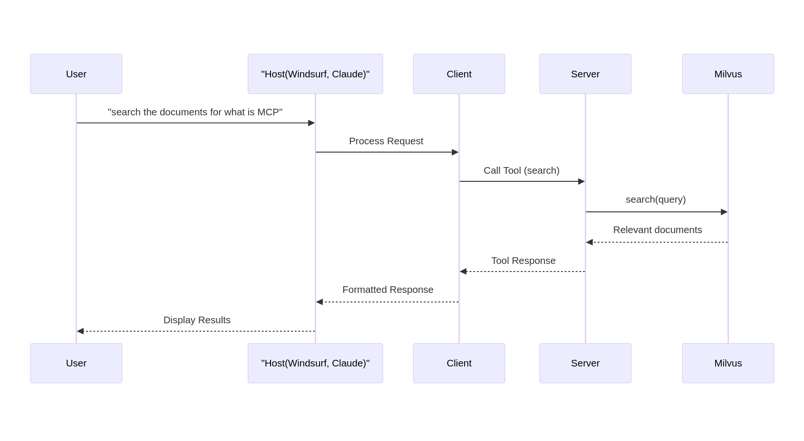

<div align="center">
<h1>MCP-Markdown-RAG</h1>
</div>

A **Model Context Protocol (MCP)** server that provides a **local-first RAG engine** for your markdown documents. This server uses a file-based Milvus vector database to index your notes, enabling Large Language Models (LLMs) to perform semantic search and retrieve relevant content from your local files.

> [!NOTE]
> This project is in active development. The API and implementation are subject to change. We are exploring future enhancements, including a potential port to an Obsidian plugin for seamless vault integration.

## 🎯 Key Features

✅ **Local-First & Private**: All your data is processed and stored locally. Nothing is sent to a third-party service for indexing.

✅ **Semantic Search for Markdown**: Go beyond simple keyword search. Find document sections based on conceptual meaning.

✅ **MCP Compatible**: Integrates with any MCP-supported host application like Claude Desktop, Windsurf, or Cursor.

✅ **Simple Tooling**: Provides two straightforward tools (`index_documents` and `search`) for managing and querying your knowledge base.

## ⚙️ How It Works

The server operates in two main phases, exposing its functionality through MCP tools.

1.  **Indexing**:

    - The `index_documents` tool is called with a path to your markdown files.
    - The server reads the documents, splits them into logical chunks (e.g., by headings), and converts each chunk into a vector embedding.
    - These embeddings, along with their metadata (original text, file path), are stored in a local Milvus vector database.

2.  **Searching**:
    - When you ask a question in a host application, it uses the `search` tool.
    - The server converts your query into a vector embedding.
    - It then performs a similarity search against the Milvus database to find the most semantically relevant document chunks.
    - The results are returned to the LLM, providing it with the context needed to answer your question accurately.

    <div align="center" >
    
    </div>

## 🛠️ Available Tools

- `index_documents` - Processes all markdown documents in a directory, creates vector embeddings, and stores them in the Milvus vector database.

  - `directory_path` (string, required): The absolute path to the directory of documents to be indexed.

- `search` - Searches the vector database for semantically relevant document chunks based on a query.
  - `query` (string, required): The question or topic you want to search for.
  - `limit` (integer, optional): The maximum number of results to return.

## 🚀 Installation & Setup

This server requires **UV** (for running the Python server).

### Step 1: Get the Server Code

Clone this repository to your local machine:

```bash
git clone https://github.com/Zackriya-Solutions/MCP-Markdown-RAG.git
```

### Step 2: Configure Your Host App

Configure your MCP host application (e.g., Windsurf, Claude.app) to use the server. Add the following to your settings file:

```json
{
  "mcpServers": {
    "markdown_rag": {
      "command": "uv",
      "args": [
        "--directory",
        "/ABSOLUTE/PATH/TO/MCP-Markdown-RAG",
        "run",
        "server.py"
      ]
    }
  }
}
```

> **Note**: Replace `/ABSOLUTE/PATH/TO/MCP-Markdown-RAG` with the absolute path to where you cloned this repository.

> **Note**: The first run will take a while and the same for the first indexing, as it needs to download the embedding model(~50MB).

## 📈 What's Next? (Roadmap)

We are actively working on improving the server. Future plans include:

- **Performance Optimization**: Improve indexing by encoding inputs in batches, which should better manage CPU usage. Additionally, we will switch to change-based indexing, which will only index new or modified files.
- **Flexible Embedding Models**: Add support for other embedding models, such as the `BGEM3-large` model for potentially higher accuracy.
- **Obsidian Plugin**: Explore creating a dedicated Obsidian plugin for a fully integrated experience.

## 🐛 Debugging

You can use the MCP inspector to debug the server directly. Run the following command from the repository's root directory:

```bash
npx @modelcontextprotocol/inspector uv --directory /ABSOLUTE/PATH/TO/MCP-Markdown-RAG run server.py
```

## 🤝 Contributing

Contributions are welcome! Please feel free to open an issue or submit a pull request.

## 🙏 Acknowledgments

- The **[Model Context Protocol](https://modelcontextprotocol.io/introduction)** for the open standard that makes this possible.
- The **[Milvus Project](https://milvus.io/)** for the powerful open-source vector database.
